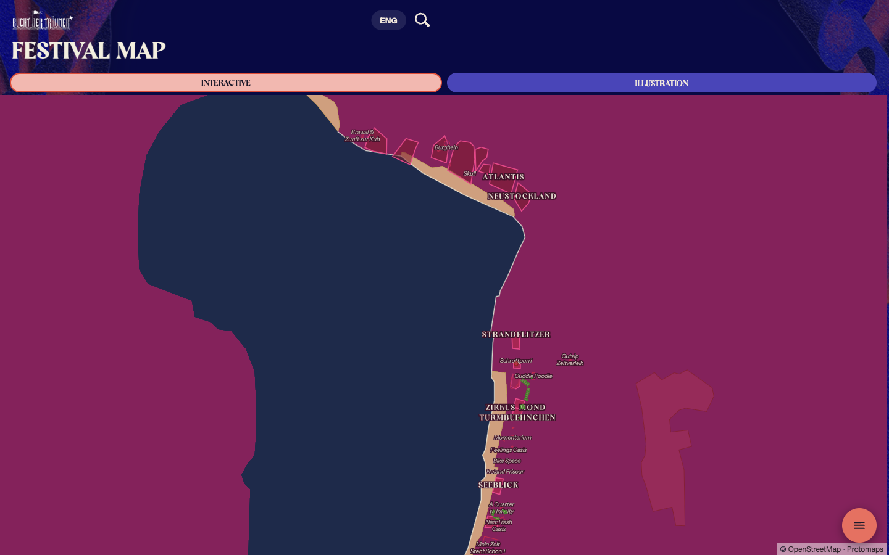
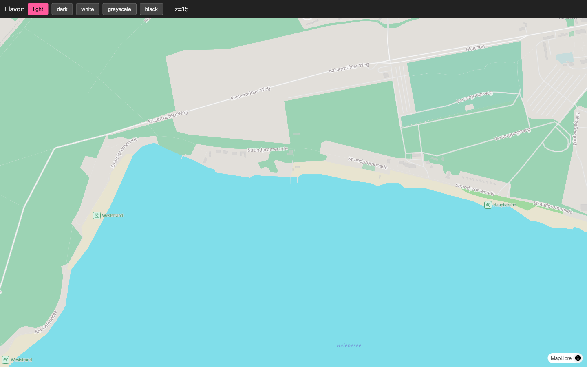
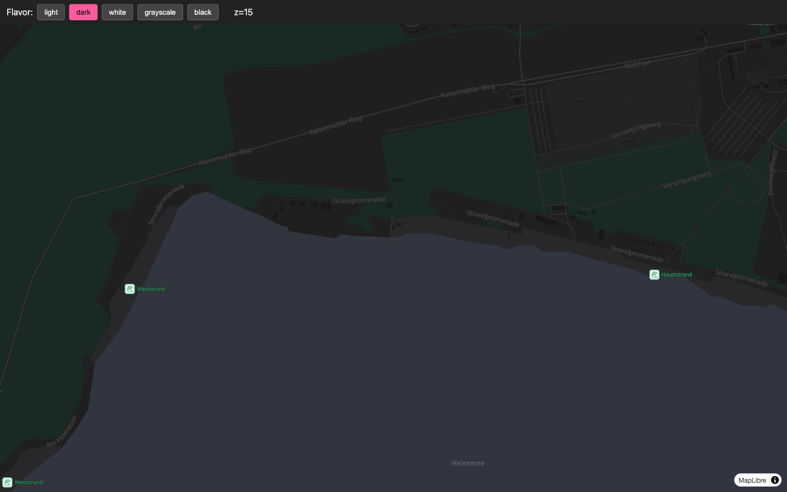
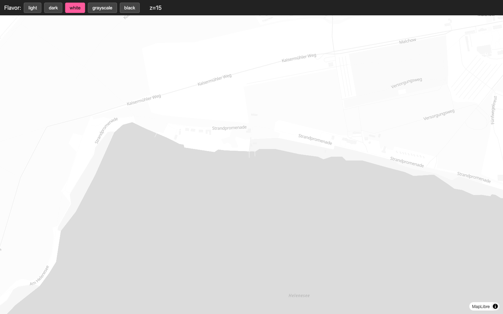
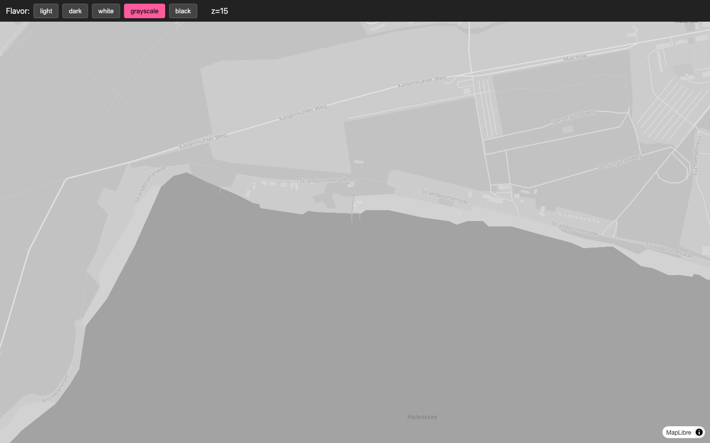
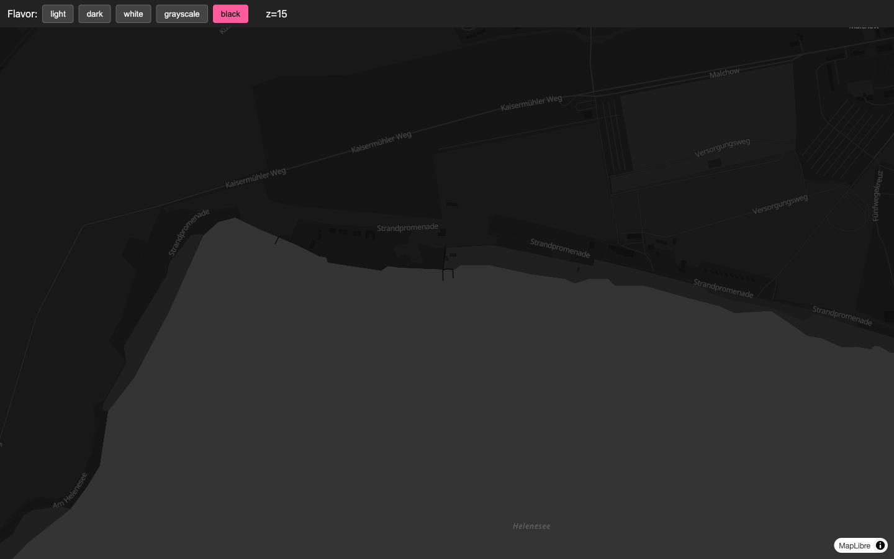
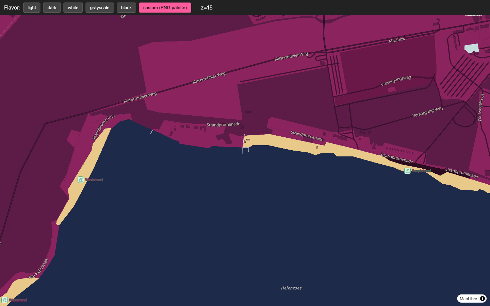

# Interactive map — theming options

Research session, 2026-08-08. All screenshots are taken at zoom 15
over our exact bbox (Helenesee north shore, `14.470..14.520 ×
52.260..52.290`), using the same `standalone/data/basemap.pmtiles`
that ships in the app today.

## TL;DR

Our current basemap paints **2 layers** (`earth`, `water`) out of the
**9** the pmtiles archive actually contains. That's why it feels
empty. The cheapest, highest-payoff move is to keep the pmtiles slice
we already ship, adopt Protomaps' full 68-layer style hierarchy, and
override its ~70 named color slots with our PNG palette. Result:
identical illustrated look + real roads, buildings, beaches, POIs.

Recommendation: **Option C (custom-tinted Protomaps theme)**.

---

## What we're actually sitting on

`pmtiles show --metadata standalone/data/basemap.pmtiles` reports:

| source-layer | min-max zoom | fields | we use it? |
| --- | --- | --- | --- |
| `earth` | 0-15 | kind, name, min_zoom | ✅ |
| `water` | 0-15 | kind, bridge, min_zoom | ✅ |
| `landuse` | 2-15 | kind, sort_rank (park/forest/farmland/school/…) | ❌ |
| `landcover` | 0-7 | kind (natural earth scale, mostly out of zoom range) | ❌ |
| `roads` | 3-15 | kind (motorway/trunk/primary/…/path), is_bridge, is_tunnel | ❌ |
| `buildings` | 11-15 | kind, kind_detail, height | ❌ |
| `boundaries` | 0-15 | kind (admin_level 2/4/…) | ❌ |
| `places` | 1-15 | name, kind (city/town/…) | ❌ |
| `pois` | 5-15 | kind, kind_detail, iata (for airports) | ❌ |

The file is **1.5 MB**. Adding all 9 layers costs **zero** extra
bytes; it's the same tiles, we're just refusing to paint 7 of them.

Metadata also reports the archive was produced by **Planetiler
0.10.2** to schema **Protomaps Basemap v4.15.1**. That's the schema
the `protomaps-themes-base` npm package (`v4.5.0`, current release)
targets, so it drops in cleanly.

---

## What Protomaps ships

Protomaps is two things:

1. **A tileset schema + planet-scale builder** (planetiler). Produces
   `.pmtiles` archives. New global builds every ~2 weeks at
   <https://build.protomaps.com/>, free for direct download (~120 GB
   global, or you slice a bbox with `pmtiles extract`).
2. **A set of default MapLibre styles** built to paint that schema.
   Published as an npm module (`protomaps-themes-base`) + on the demo
   viewer at <https://maps.protomaps.com/>.

The default styles come in **5 flavors**, each producing 66-68
MapLibre layers:

| flavor | intent | link |
| --- | --- | --- |
| `light` | Google-Maps-lookalike | <https://maps.protomaps.com/#flavorName=light> |
| `dark` | dark UI companion | <https://maps.protomaps.com/#flavorName=dark> |
| `white` (data viz) | near-empty, pure white land | <https://maps.protomaps.com/#flavorName=data%20viz%20(white)> |
| `grayscale` (data viz) | desaturated background for chart overlays | <https://maps.protomaps.com/#flavorName=data%20viz%20(grayscale)> |
| `black` (data viz) | inverted "grayscale" | <https://maps.protomaps.com/#flavorName=data%20viz%20(black)> |

Under the hood each is just:
```js
import { layers, namedTheme } from 'protomaps-themes-base';
const style = { version: 8, sources: {...},
    layers: layers('basemap', namedTheme('light'), { lang: 'en' }) };
```

Repo: <https://github.com/protomaps/basemaps> · npm:
<https://www.npmjs.com/package/protomaps-themes-base>.

`namedTheme(flavor)` returns a flat object of ~70 named color slots
(`background`, `earth`, `park_a`, `water`, `wood_a`, `buildings`,
`minor`, `major`, `roads_label_minor`, `city_label`, …). You can pass
a fully custom theme to `layersWithCustomTheme('basemap', myTheme,
'en')` and get the same 68 layers with your colors.

---

## Side-by-side over our bbox

All at zoom 15, Helenesee north shore. See
`assets/2026-08-08-map-theming/`.

### Where we are today (2 layers, magenta blob)


### Protomaps `light` (68 layers, roads + buildings + beach + POIs)


### Protomaps `dark`


### Protomaps `data viz (white)`


### Protomaps `data viz (grayscale)`


### Protomaps `data viz (black)`


### Option C: `light` layer hierarchy + PNG palette override


That last one is the illustrated look with the real OSM roads
(Kaisermühler Weg, Strandpromenade, Versorgungsweg), building
footprints, the sandy beach strip along the shore, and Weststrand /
Hauptstrand POI markers — **from the exact same pmtiles we already
ship**.

---

## Options

### A · Keep our custom style, add more layers by hand

Extend `buildStyle()` in `map-interactive.js` with fill/line entries
for `landuse`, `buildings`, `roads`, and (maybe) `pois`. Handpick
zoom stops.

- Effort: 1-2 h, plus tweaking. Every new layer costs another zoom
  interpolation curve to author.
- Pros: total control, no dependency.
- Cons: reinventing what `protomaps-themes-base` already got right
  (line widths per road kind, per-zoom label sizes, tunnel/bridge
  casings, one-way arrows).
- Bundle: **+0 bytes** (all source-layers already in pmtiles).

### B · Adopt a Protomaps default flavor as-is

Import the layer array for `light` / `dark` / etc. Wrap it in our
existing pmtiles source, keep our overlay layers on top.

- Effort: **30 min**. Add `protomaps-themes-base` to the vendored
  deps, replace `buildStyle()` body.
- Pros: cartographically correct out of the box, all 5 flavors
  swappable via one string.
- Cons: doesn't look like the illustrated PNG. The `light` flavor is
  Google-Maps-beige; `dark` is standard cartography-dark. Reads
  "generic map", not "festival".
- Bundle: **+~30 KB** minified (the theme package + its slot table).

### C · Custom-tinted Protomaps theme *(recommended)*

Same as B, but replace the flavor's color slots with our PNG palette
before building the style:

```js
import { layersWithCustomTheme, namedTheme } from 'protomaps-themes-base';

const theme = {
    ...namedTheme('light'),
    background: PNG_LAND_DEEP,
    earth: PNG_LAND_MID,
    wood_a: '#3a1230', wood_b: '#2a0b20',
    park_a: '#7a1c50', park_b: '#5c1c47',
    sand: PNG_BEACH, beach: PNG_BEACH,
    water: PNG_WATER,
    buildings: '#3a1230',
    minor_a: '#3a1230', minor_b: '#4a1a3a',
    major: '#5a2244', highway: '#6a2a4e',
    roads_label_minor: PNG_CREAM,
    roads_label_major_halo: '#2a0b20',
    // …roughly a dozen more overrides
};

const layers = layersWithCustomTheme('basemap', theme, 'en');
```

- Effort: **2-3 h**. Overriding ~15-20 slots gets us to the mockup
  above; the remaining ~50 slots inherit from `light` and are fine
  (they mostly affect edge cases we don't see: tunnel casings, glacier
  labels, aerodrome runways).
- Pros: identical illustrated look, but every road, path, building,
  beach and shore is real vector data → the map has the *density* of
  the PNG plus the *interactivity* of vectors (labels stay legible on
  rotate, features are still hit-testable for popups). Also gives us
  a natural home for a future dark mode: swap the base flavor from
  `light` to `dark` and re-apply the palette.
- Cons: adds one npm dependency (`protomaps-themes-base@4.5.0`,
  MIT-licensed). Palette override is a manual list to maintain if we
  ever change our brand.
- Bundle: **+~30 KB** minified.

### D · Community / third-party styles

There are a handful of Protomaps-compatible community styles
(<https://github.com/protomaps/basemaps#user-styles>, plus scattered
gists). None of them match the illustrated aesthetic; they're
variations on the built-in flavors. Not worth the search cost.

### E · Ditch Protomaps, use our own hand-drawn geojson

Trace roads / buildings in QGIS from the OSM export, style them
purely in geojson layers, drop the pmtiles entirely.

- Pros: total artistic freedom, smallest bundle if we're stingy.
- Cons: loses the OSM data freshness (paths change; buildings get
  built), no automatic label placement, no zoom curves for free.
  Probably ~1-2 days of tracing + labelling for a strip this size.
  Only makes sense if we decide the PNG *is* the design and we want
  to freeze it.

---

## Recommendation

**Option C — custom-tinted Protomaps `light` theme.**

The 68-layer paint stack is what makes the interactive map read as
"a place" instead of "a color swatch." We can keep our PNG palette
verbatim, and every layer we currently paint by hand
(`osm-features`, `helenesee-shore`, stages, venues, food) still
stacks on top exactly like today — nothing about the overlay layer
code changes.

### Follow-up steps if approved

1. Vendor `protomaps-themes-base` into `standalone/vendor/` (or
   inline the layer array via a build step; the module is
   ~30 KB minified). Add to SW SHELL_ASSETS.
2. Rewrite `buildStyle()` in `map-interactive.js` to call
   `layersWithCustomTheme('basemap', PNG_THEME, 'en')` and merge our
   overlay layers on top.
3. Move the ~70 `PNG_*` color constants and the theme-override map
   into a new `standalone/js/views/map-palette.js` (foreshadowed as
   S1 in the last review).
4. Suppress the Protomaps sprite (or vendor our own) so the green
   swimmer / airport icons don't clash with our overlay iconography.
5. Regenerate glyphs if any Protomaps label field wants a font we
   don't already SDF-ify. Current stacks (Megan Display, Instrument
   Sans Italic, Lato Regular/Bold) cover the Protomaps label
   requirement (`Noto Sans Regular` → we can alias to Lato Regular).

### Cleanup after this research session

Not committed, and to be removed before landing anything:

- `standalone/theme-explorer.html` — the browser-driven flavor
  switcher used to produce the screenshots above.
- `standalone/style-{light,dark,white,grayscale,black,custom}.json` —
  static exports of each theme's layer array, only referenced by
  `theme-explorer.html`.
